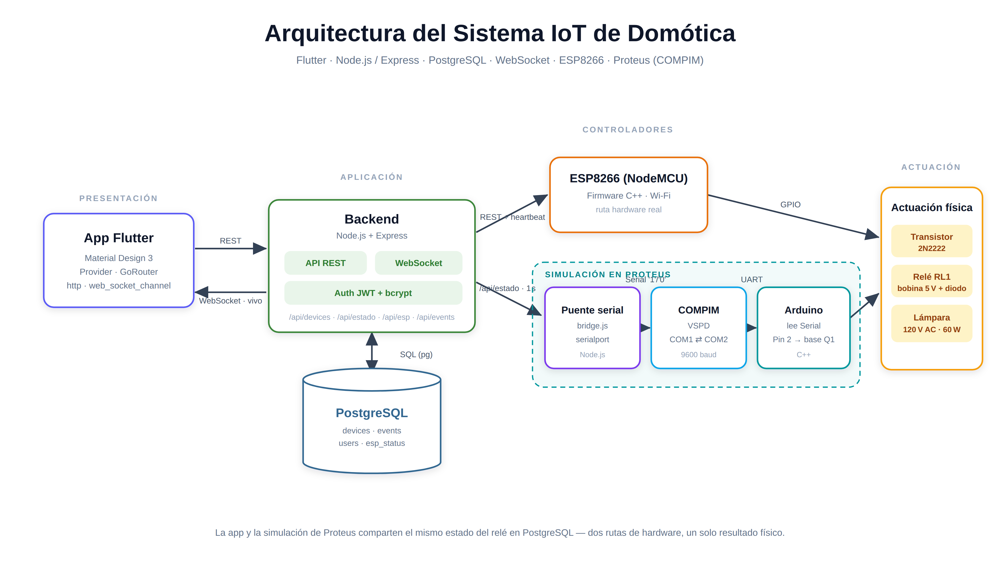

# 🏠 Prototipo de Sistema IoT para Domótica (Smart Home)

Sistema de domótica de extremo a extremo que permite **controlar cargas
eléctricas en tiempo real** desde una aplicación móvil, usando un
microcontrolador **NodeMCU ESP8266** como nodo físico, un **backend propio**
(Node.js + PostgreSQL) como bróker y **WebSockets** para la sincronización.

> Proyecto universitario · Ingeniería de Sistemas
> Autores: **Valeryn Duque** & **Juan Vrasmatas**

---

## ✨ Características

- 🔐 **Autenticación** propia con JWT + bcrypt (registro, login, recuperación).
- 💡 **Control de dispositivos** (luces, ventilador, puerta, tomacorriente) por relés.
- ⚡ **Tiempo real bidireccional**: la app y el ESP8266 se sincronizan por WebSocket/REST.
- 🗄️ **Datos reales en PostgreSQL** (base de datos relacional).
- 🏘️ **Gestión por habitaciones** (Sala, Cocina, Dormitorio…).
- 📊 **Estado del sistema**: IP, SSID, señal Wi-Fi (RSSI), uptime, firmware, memoria.
- 📡 **Indicador online/offline** del ESP8266 basado en *heartbeat*.
- 🕑 **Historial de eventos** ("Luz Sala encendida a las 19:35").
- 🧩 **Detalle técnico** de cada dispositivo (GPIO, estado, última sincronización).
- 🌗 **Modo claro / oscuro** con Material Design 3.
- 🎬 Animaciones (Hero, Fade, Slide, AnimatedSwitcher, AnimatedContainer) y *glassmorphism*.

---

## 🏗️ Arquitectura



> Diagrama vectorial en [`docs/arquitectura.svg`](docs/arquitectura.svg) (insertable en PowerPoint) y en PNG de alta resolución en [`docs/arquitectura.png`](docs/arquitectura.png).

```
┌──────────────────┐   REST + WebSocket   ┌──────────────────────┐   SQL   ┌──────────────┐
│   App Flutter     │ ◀──────────────────▶ │  Backend Node.js      │ ◀─────▶ │  PostgreSQL   │
│  (Material 3)      │                      │  (Express + ws + JWT) │         │  (relacional) │
└──────────────────┘                      └──────────┬───────────┘         └──────────────┘
                                                      │ REST (x-device-key)
                                                      ▼
                                           ┌──────────────────────┐
                                           │   NodeMCU ESP8266     │
                                           │   (C++ / relés)       │
                                           └──────────────────────┘
```

- La **app** envía comandos por REST y recibe cambios en tiempo real por **WebSocket**.
- El **ESP8266** consulta y confirma estados por REST (polling) y publica su telemetría.
- El **backend** persiste todo en **PostgreSQL** y difunde los cambios a las apps.

### Estructura del proyecto

```
Prototipo-IoT-Domotica/
├── lib/                         → App Flutter (Clean Architecture)
│   ├── core/         (config, theme, routes, utils)
│   ├── models/       (device, user, room, event, esp)
│   ├── services/     (api_client, realtime_client, auth_service, token_storage)
│   ├── repositories/ (auth, device, event, esp)
│   ├── controllers/  (estado con Provider)
│   ├── screens/      (splash, auth, dashboard, detalle, ajustes, …)
│   └── widgets/      (componentes reutilizables)
├── backend/                     → API REST + WebSocket (Node.js + PostgreSQL)
│   ├── src/          (rutas, controladores, middleware, ws, db)
│   ├── db/           (schema.sql, seed.sql)
│   └── docker-compose.yml
├── firmware/
│   └── prototipo_iot_domotica/  → Sketch Arduino para ESP8266 (REST)
├── proteus-bridge/              → Puente serial API↔Proteus + sketch Arduino (COMPIM)
├── docs/                        → Guías de backend y Arduino
├── pubspec.yaml
└── README.md
```

---

## 🛠️ Tecnologías

| Capa | Tecnología |
|---|---|
| Frontend | Flutter (Dart), Material Design 3, Google Fonts, flutter_animate |
| Estado | Provider (ChangeNotifier) |
| Navegación | GoRouter |
| Red (app) | http (REST) + web_socket_channel (tiempo real) |
| Backend | Node.js, Express, ws, jsonwebtoken, bcryptjs |
| Base de datos | PostgreSQL |
| Hardware | NodeMCU ESP8266 (C++ / Arduino) + ArduinoJson |

---

## 🚀 Puesta en marcha

### 1) Backend + PostgreSQL

Guía completa en [`docs/BACKEND_SETUP.md`](docs/BACKEND_SETUP.md). Rápido con Docker:

```bash
cd backend
cp .env.example .env          # cambia JWT_SECRET y DEVICE_API_KEY
docker compose up --build     # levanta PostgreSQL + API con esquema y seed
```

La API queda en `http://localhost:3000` (WebSocket en `/ws`).

### 2) App Flutter

```bash
# Genera las carpetas de plataforma (no toca lib/):
flutter create . --project-name prototipo_iot_domotica --platforms=android,ios,web
flutter pub get

# Ejecuta apuntando al backend (elige según tu caso):
flutter run                                        # emulador Android (10.0.2.2)
flutter run --dart-define=API_HOST=192.168.1.100   # dispositivo físico (IP LAN)
flutter run --dart-define=API_HOST=localhost       # web / escritorio
```

Regístrate con un correo y contraseña; el dashboard mostrará los 4 dispositivos
del *seed*. Al alternarlos, el estado se guarda en **PostgreSQL** y se propaga
en tiempo real.

### 3) Firmware ESP8266

Guía completa en [`docs/ARDUINO_SETUP.md`](docs/ARDUINO_SETUP.md). Resumen:

1. Instala el core **ESP8266** y la librería **ArduinoJson** (v6.x).
2. Abre `firmware/prototipo_iot_domotica/prototipo_iot_domotica.ino`.
3. En `Config.h` pon tu Wi-Fi, `API_HOST` (IP LAN de la PC) y `DEVICE_API_KEY`
   (igual a la del backend).
4. Compila y sube. Monitor Serie a `115200`.

### Conexión de relés (ejemplo)

| Relé | GPIO | Pin NodeMCU | Dispositivo |
|---|---|---|---|
| 1 | GPIO5  | D1 | Luz Sala |
| 2 | GPIO4  | D2 | Luz Cocina |
| 3 | GPIO14 | D5 | Ventilador |
| 4 | GPIO12 | D6 | Tomacorriente |

> ⚠️ Muchos módulos de relé son **activos en bajo**. Ajusta `RELAY_ACTIVE_LOW`
> en `Config.h`. Para cargas de 110/220 V toma precauciones eléctricas.

---

## 🧪 Flujo completo

1. El ESP8266 publica telemetría → la app muestra **online**.
2. Pulsas "Luz Sala" en la app → `POST /api/devices/dev_luz_sala/state`.
3. El backend actualiza PostgreSQL, registra el evento y difunde por WebSocket.
4. El ESP8266 (polling) detecta el cambio, activa el relé y confirma.
5. Todas las apps conectadas ven el cambio y el nuevo evento al instante.

## 🧩 Simulación en Proteus (COMPIM)

Además del ESP8266 físico, el sistema puede accionar un **relé simulado en
Proteus** mediante un Arduino conectado a un `COMPIM` por puerto serial virtual.
El puente `proteus-bridge/` consulta `GET /api/estado` y envía `'1'`/`'0'` por el
puerto COM; el Arduino lee el Serial y controla el transistor (PIN 2) que
conmuta el relé y la lámpara de 120 V. Guía completa e instrucciones de VSPD +
COMPIM en [`proteus-bridge/README.md`](proteus-bridge/README.md).

```
Flutter → API (/api/estado) → PostgreSQL → bridge.js → COM2⇄COM1 → COMPIM → Arduino → relé → lámpara
```

---

## 🔎 Estado de verificación

- ✅ **Pruebas automatizadas del backend con Jest + Supertest** (32 tests, 6
  suites): auth, dispositivos, eventos, telemetría del ESP, `/estado` y WebSocket
  en tiempo real. Usan `pg-mem` (PostgreSQL en memoria), así que corren en
  cualquier máquina: `cd backend && npm test`. Se ejecutan en CI con GitHub Actions.
- ✅ **Backend probado también contra PostgreSQL real** de extremo a extremo.
- La app Flutter consume estos mismos contratos JSON (verificados).

---

## 📄 Licencia

Proyecto académico con fines educativos. Uso libre para aprendizaje.

---

<p align="center">Hecho con ❤️ y ⚡ por Valeryn Duque &amp; Juan Vrasmatas</p>
